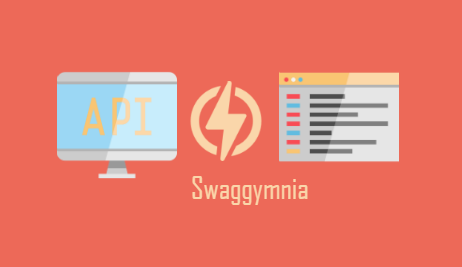
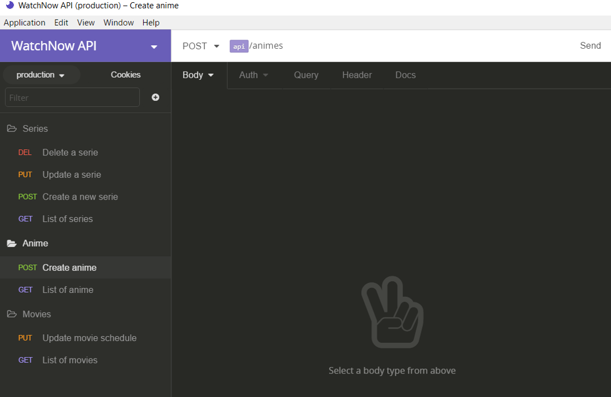
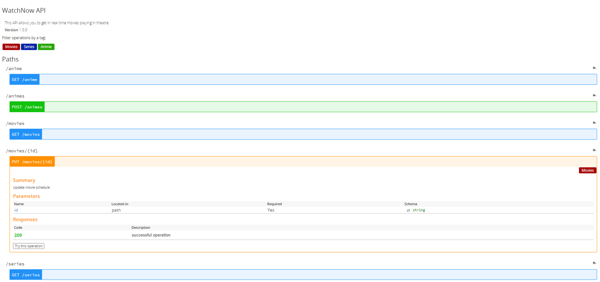

<div align="center">
  
</div>

[](https://circleci.com/gh/mlabouardy/swaggymnia/tree/master) [](LICENSE) [](https://goreportcard.com/report/github.com/mlabouardy/swaggymnia)

Generate Swagger Documentation from Insomnia REST Client

## Download

Below are the available downloads for the latest version of Swaggymnia  (1.0.0-beta). Please download the proper package for your operating system and architecture.

### Linux:

```
wget https://s3.amazonaws.com/swaggymnia/1.0.0-beta/linux/swaggymnia
```

### Windows:

```
wget https://s3.amazonaws.com/swaggymnia/1.0.0-beta/windows/swaggymnia
```

### Mac OS X:

```
wget https://s3.amazonaws.com/swaggymnia/1.0.0-beta/osx/swaggymnia
```

### FreeBSD:

```
wget https://s3.amazonaws.com/swaggymnia/1.0.0-beta/freebsd/swaggymnia
```

### OpenBSD:

```
wget https://s3.amazonaws.com/swaggymnia/1.0.0-beta/openbsd/swaggymnia
```

## How to use it

See usage with:

```
$ swaggymnia --help
```

Generate Swagger documentation:

```
$ swaggymnia generate -insomnia INSOMNIA_EXPORTED_FILE -config CONFIG_FILE -output FORMAT
```

| Option | Description |
| ------ | ----------- |
| -insomnia | Insomnia exported file |
| -config | API Global Configuration file (see [Configuration Format](#configuration-format))|
| -output | Insomnia output format (json or yaml, default json)  |


## Example

Let's convert the following Insomnia API documentation to Swagger:

<div align="center">
  
</div>

Issue the following command:

```
$ swaggymnia generate -i examples/watchnow.json -c examples/config.json -o json
```

<div align="center">
  
</div>

## Configuration Format

```
{
  "title" : "API Name",
  "version" : "API version",
  "host" : "API URL",
  "basePath" : "Base URL",
  "schemes" : "HTTP protocol",
  "description" : "API description"
}
```

## Tutorials

* [Generate beautiful Swagger Documentation from Insomnia](http://www.blog.labouardy.com/generate-swagger-documentation-from-insomnia-rest-client/)

## Maintainers

- Mohamed Labouardy - mohamed@labouardy.com

## License

This project is licensed under the MIT License - see the [LICENSE](LICENSE) file for details
